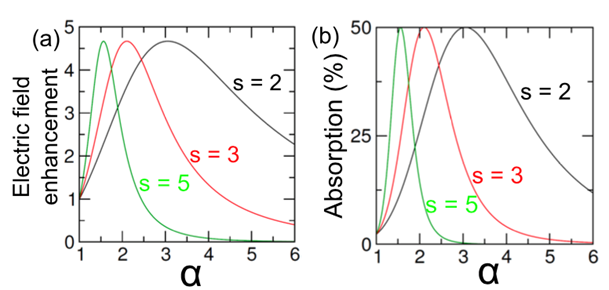
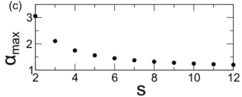

### Bagaimana cara meningkatkan serapan cahaya oleh graphene?

Pada halaman ini, saya bercerita mengenai paper yang telah saya publikasikan. 

#### [Significant enhancement of light absorption in undoped graphene using dielectric multilayer system](http://aip.scitation.org/doi/abs/10.1063/1.5012604)

Paper ini bercerita mengenai metode peningkatan serapan cahaya oleh graphene yang tidak didoping. Graphene biasanya hanya dapat menyerap 2.3% dari intensitas cahaya datang. tetapi, dengan meletakan graphene di dalam suatu struktur khusus dan memanfaatkan fenomena interferensi dari medan listrik, serapan cahaya dapat meningkat menjadi 50%.

---

#### Pemantulan, transmisi dan serapan cahaya oleh graphene
Bila cahaya menjalar melalui dua media dengan indeks bias yang berbeda, cahaya akan dipantulkan dan ditransmisikan. Besarnya intensitas cahaya yang dipantulkan dan ditransmisikan bergantung pada perbedaan nilai indeks bias kedua media tersebut dan juga sudut datang cahaya. Untuk memenuhi kekekalan energi, maka total intensitas cahaya yang dipantulkan dan ditransmisikan akan sama dengan intensitas cahaya datang. Tetapi, apabila medium kedua adalah logam yang indeks biasnya kompleks, maka cahaya datang akan juga diserap oleh medium kedua, sehingga  total intensitas cahaya yang dipantulkan dan ditransmisikan akan kurang dari satu. Energi cahaya yang diserap oleh material akan berubah menjadi energi panas yang dikenal dengan nama Joule’s heat. Serapan cahaya ini dapat dimanfaatkan dalam proses pemanasan suatu sampel, pembuatan photodetector, sel surya, maupun antena. 

Untuk mendapatkan besarnya intensitas cahaya yang dipantulkan dan ditransmisikan, kita dapat menggunakan kondisi batas dari gelombang elektomagnetik. Kondisi batas dapat diturunkan dari persamaan Maxwell. Semisal kita fokus pada komponen medan listrik dan magnet yang sejajar dengan permukaan batas antara kedua media, maka kondisi batas untuk medan listrik (E) dan magnet (H) adalah,

J adalah arus listrik yang mengalir dipermukaan batas. Indeks i, r, dan t adalah untuk cahaya datang, pantul, dan transmisi. Medan magnet dapat dihubungkan dengan medan listrik sebagai berikut,

Di mana Z adalah impedans dari cahaya saat merambat dalam suatu medium. Impedans suatu medium dapat dianggap sebagai hambatan cahaya dalam merambat, sehingga Z memiliki satuan Ohm. Z dapat dihubungkan dengan indeks bias (n) sebagai berikut,

Bagaimana dengan arus J pada persamaan (2)? Bila kita meletakan sebuah material yang sangat tipis di antara kedua media, maka material tipis ini dapat dimodelkan sebagai arus J. Sebagai contoh, bila kita meletakan graphene yang merupakan material dua dimensi (2D) dengan ketebalan sekitar 10 nm, maka arus J dapat dituliskan sebagai berikut

Di mana σ=e2/4ℏ adalah konduktivitas dari graphene. Perlu dicatat bahwa dalam kasus ini, kita mengambil graphene yang tidak didoping. Dengan menggunakan persamaan (1) – (4), maka kita mendapatkan persamaan berikut,

Dan kita memperoleh persamaan medan listrik yang dipantulkan sebagai berikut,

Koefisien pantul (R) , transmisi (T) dan serapan (A) cahaya dapat ditulis sebagai berikut,

Semisal kita anggap graphene berada di ruang vakum, maka dari persamaan (4), Z1=Z2=377 Ohm. Besarnya serapan cahaya oleh graphene yang berada di ruang vakum adalah sebesar,

Dari persamaan di atas, kita peroleh bahwa graphene menyerap 2.3 % intensitas cahaya yang datang. Untuk material yang sangat tipis, serapan cahaya oleh graphene relatif besar. Tetapi, apakah kita masih bisa meningkatkan besar serapan cahaya ini? Sebelum menjawab pertanyaan tersebut, mari kita bahas penyebab fisis dari serapan cahaya yaitu Joule’s heat. Secara matematis, Joule’s heat  adalah perkalian antara arus dan medan listrik yang ada di permukaan graphene. Joule’s heat (P) dapat dituliskan sebagai berikut,

Bila kita membagi P dengan intensitas cahaya datang seperti di bawah ini,

Maka kita mendapatkan kembali koefisien serapan cahaya A seperti di persamaan (13). Maka terbukti, bahwa serapan cahaya adalah panas yang muncul di permukaan graphene. Dari penyebab fisis serapan cahaya, maka jika kita ingin meningkatkan serapan cahaya oleh graphene, kita harus meningkatkan besarnya medan listrik yang ada di permukaan graphene. Ada beberapa cara untuk meningkatkan medan listrik pada permukaan graphene, seperti mendoping graphene atau juga dengan memanfaatkan interferensi cahaya yang dapat menguatkan medan listrik cahaya. Kita akan membahas lebih lanjut metode kedua, yaitu dengan interferensi untuk meningkatkan serapan cahaya oleh graphene.

---

#### Meningkatkan serapan cahaya oleh graphene dengan interferensi.

Seperti yang sudah kita simpulkan pada bagian sebelumnya, bahwa serapan cahaya oleh graphene sebanding dengan besarnya medan listrik yang ada dipermukaan graphene. Maka bila graphene ditempatkan di dalam suatu struktur, di mana cahaya dapat berinteferensi, maka serapan cahaya dapat ditingkatkan. Sebagai contoh struktur tersebut adalah struktur di bawah ini.

Pada struktur ini, graphene (G) berada di tengah struktur multilayer dari medium A dan B dengan indeks bias nA dan nB. Susunan medium A dan B dibalik setelah cahaya melewati graphene, seperti pada gambar. Karena struktur terdiri atas banyak lapisan medium, maka saat cahaya masuk, cahaya akan dipantulkan berkali-kali di dalam struktur sebelum ditransmisikan keluar struktur, yang menyebabkan medan listrik cahaya diperkuat di dalam struktur. Sehingga serapan cahaya juga dapat diperkuat.

Bagaimana cara kita memodelkan penjalaran cahaya di dalam struktur multilayer tersebut? Model paling sederhana adalah dengan menggunakan metode transfer matriks. Untuk memahami metode transfer matriks, maka mari kita lihat gambar di bawah ini.

Gambar di atas menunjukkan penjalaran cahaya di dalam struktur multilayer. Pada saat cahaya masuk, yaitu pada z = 0, total medan listrik dan magnet kontinu, karena tidak ada graphene (arus J = 0), maka kita peroleh persamaan berikut,

Dengan menggunakan definisi impedans dari persamaan (4), maka kita bisa menuliskan persamaan (14) and (15) dalam bentuk matriks sebagai berikut,

Setelah memasuki medium 1, cahaya menjalar dalam medium tersebut sejauh ℓ1, yaitu ketebalan medium 1. Hubungan antara medan listrik di z = 0 dan z = ℓ1 diberikan oleh persamaan matriks berikut,

Sehingga, proses penjalaran cahaya sepanjang medium satu dapat dituliskan dalam perkalian matriks M0 dan P1, sebagai berikut

Matriks Mi dan  Pi dinamakan sebagai matriks matching dan propagasi untuk medium i. Maka jika kita memiliki banyak lapisan medium, penjalaran cahaya dalam struktur tersebut dapat dituliskan sebagai perkalian matriks matching dan propagasi. Sebagai catatan, bila ada graphene di antara dua medium B (seperti pada gambar struktur), maka arus J tidak sama dengan nol, sehingga matriks matching dengan graphene diberikan sebagai berikut,

Sebagai contoh, semisal kita memiliki suatu struktur ABGBA, maka penjalaran cahaya dapat dimodelkan sebagai berikut,

Hasil perkalian semua matriks Mi dan  Pi inilah yang dinamakan transfer matriks. Hanya dengan mengambil komponen dari transfer matriks, kita dapat menentukan besarnya koefisien pantul (R), transmisi (T) dan serapan (A) dari cahaya, sebagai berikut,

---

#### Serapan cahaya oleh graphene mencapai 50%.
Setelah melakukan perhitungan dengan menggunakan metode transfer matriks, maka kita memperoleh besarnya koefisien serapan dan juga medan listrik pada permukaan graphene. Ekspresi analitik dari koefisien serapan (A) dan medan listrik pada permukaan graphene E(c)  adalah sebagai berikut,

Di mana α=nA/nB dan s adalah jumlah repetisi struktur AB sebelum posisi graphene. Dari persamaan (23) Nampak bahwa besarnya koefisien serapan sebanding dengan penguatan medan listrik pada permukaan graphene, yang menunjukkan bahwa penyebab serapan cahaya adalah Joule’s heat (persamaan (12)). Apakah medan listrik benar dikuatkan oleh struktur ini? Mari kita lihat grafik dari penguatan medan listrik E(c)/E(0)+ ) dan juga A sebagai fungsi α untuk beberapa repetisi s di bawah ini,

Kita dapat melihat bahwa medan listrik pada permukaan graphene dapat dikuatkan hingga 4.5 kali lebih besar daripada medan listrik cahaya yang datang. Maksimum dari penguatan medan listrik tidak berubah meskipun jumlah repetisi s berubah, hanya saja posisi maksimumnya berada pada nilai α yang berbeda-beda. Besar koefisien serapan juga mengikuti besarnya penguatan medan listrik, di mana kita dapati serapan maksimum saat penguatan medan listrik juga maksimum. Maksimum dari serapan cahaya adalah 50%! Jauh lebih besar daripada serapan cahaya oleh graphene dalam ruang vakum, yaitu 2.3%. 

Seperti yang telah dijelaskan sebelumnya, nilai  α yang memberikan maksimum dari penguatan medan listrik dan koefisien serapan (αmax) bergantung pada jumlah repetisi s. Di bawah, kami berikan grafik αmax sebagai fungsi repetisi s.

Kita bisa lihat bahwa αmax berbanding terbalik dengan repetisi s. Jadi, kita tidak perlu banyak repetisi untuk mendapatkan serapan 50%, tetapi kita nilai α yang dibutuhkan haruslah besar, sebagai contoh untuk s = 2, nilai  nA=3 nB . Apabila nilai α yang tersedia tidak bisa besar, maka untuk memperoleh serapan 50%, kita butuh lebih banyak repetisi. Sebagai catatan tambahan, nilai koefisien pantul dan transmisi masing-masing adalah 25% saat nilai serapan 50%. Salah satu aplikasi dari struktur ini adalah sebagai alat pemanas suatu sampel yang diletakan pada posisi graphene, karena 50% dari energi cahaya datang diubah menjadi panas pada permukaan graphene karena proses serapan. 

---

